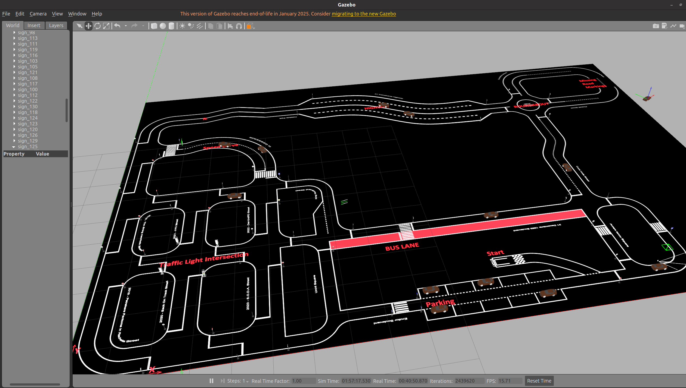

# Simulator



**Simulation Environment for the Bosch Future Mobility Challenge**  
[Official Challenge Website](https://boschfuturemobility.com/)

This simulator provides an environment for testing autonomous vehicle algorithms in the context of the Bosch Future Mobility Challenge. It is also used for our development of an autonomous driving pipeline. See our repository: [Autonomous Driving Pipeline](https://github.com/simonli357/AD). The starter code is based on the repository from [ECC-BFMC/Simulator](https://github.com/ECC-BFMC/Simulator).

---

## 📁 Project Structure

- **example/** - Example scripts demonstrating interaction with the simulator.
- **models_pkg/** - Contains SDF files describing car components and other objects in the simulation.
- **realsense_ros_gazebo/** - Provides a plugin to simulate the Intel RealSense D435i camera.
- **plugins_pkgs/** - Code responsible for simulating car components such as GPS, motor, and servo commands.
- **sim_pkg/** - Launch files for starting the simulation world.
- **traffic_light_pkg/** - Handles traffic light simulation.
- **utils/** - Provides `msg` and `srv` files needed by other packages.
- **localization_bridge/** - Simulates the GPS system used in the competition, incorporating a 1-second delay and uniform noise of 0.2.

---

## 🛠 Dependencies

### ROS Installation
Ensure that ROS is installed before using this simulator. Follow the instructions in the [ROS Installation Guide](http://www.autolabor.com.cn/book/ROSTutorials/chapter1/12-roskai-fa-gong-ju-an-zhuang/124-an-zhuang-ros.html).

---

## 🔧 Build Instructions

1. **Clone the Repository**
    ```bash
    cd
    git clone https://github.com/slsecrets357/Simulator.git
    ```

2. **Build the Packages**
    ```bash
    catkin_make --pkg utils
    catkin_make
    ```

3. **Configure Environment Variables** (after building/catkin_make)
    Open the setup script:
    ```bash
    gedit devel/setup.bash
    ```
    Add the following lines, replacing `{YOUR_USER}` with your actual username:
    ```sh
    export GAZEBO_MODEL_PATH="/home/{YOUR_USER}/Documents/Simulator/src/models_pkg:$GAZEBO_MODEL_PATH"
    export ROS_PACKAGE_PATH="/home/{YOUR_USER}/Documents/Simulator/src:$ROS_PACKAGE_PATH"
    ```

---

## 🚀 Usage

1. **Start the Gazebo Simulation**
    ```bash
    source devel/setup.bash
    roslaunch sim_pkgs run3.launch
    ```

2. **Modify Object Spawning**  
   To customize the objects and their locations in the simulation, edit the `spawn_signs.launch` file located in `sim_pkg/`.

---

Enjoy simulating! 🚗💨

